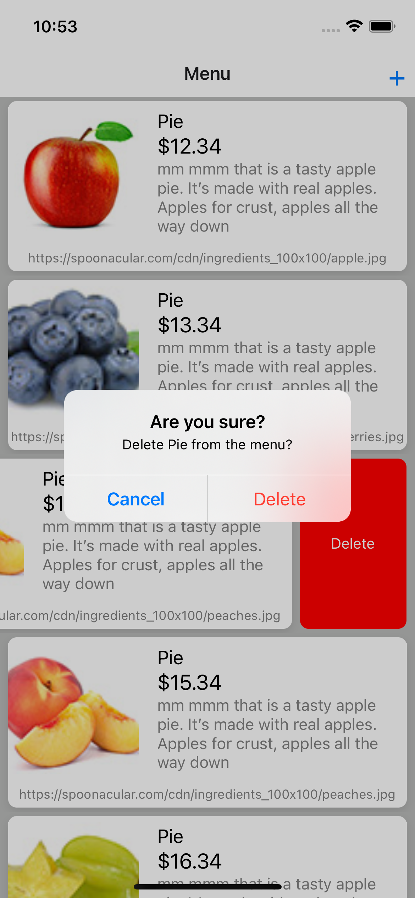
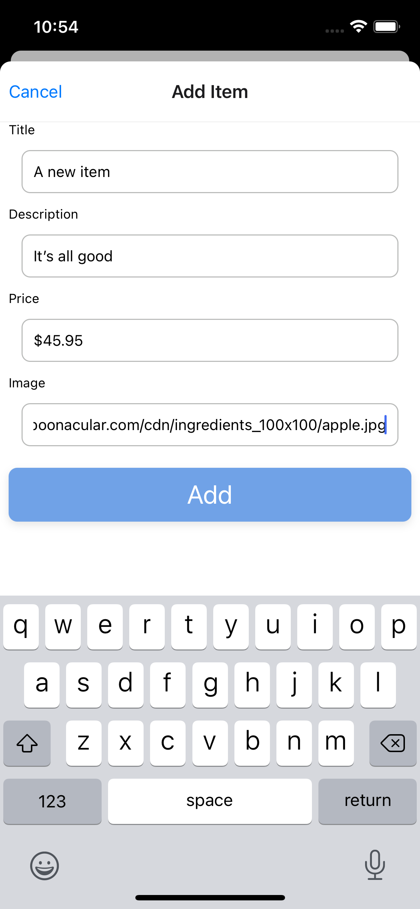

# Install and run
Install from command line: `yarn`

Run from command line: `yarn ios`

Run in Xcode: open `ios/menu.xcworkspace` in Xcode

Test from command line: `yarn test`

# Screenshots
Menu List

Add Item

